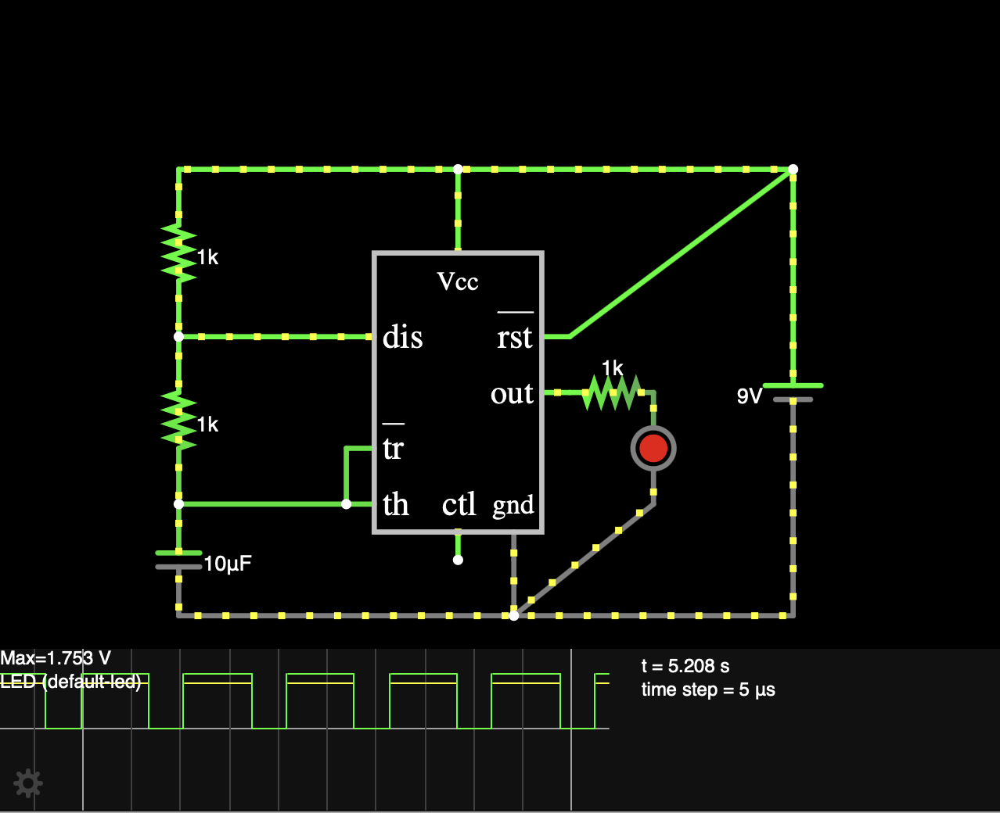
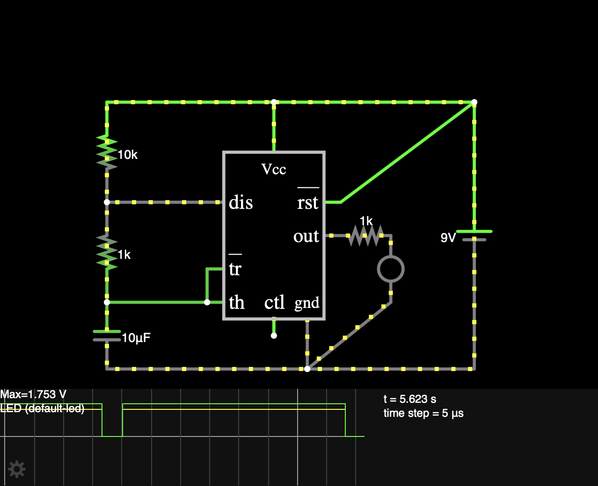
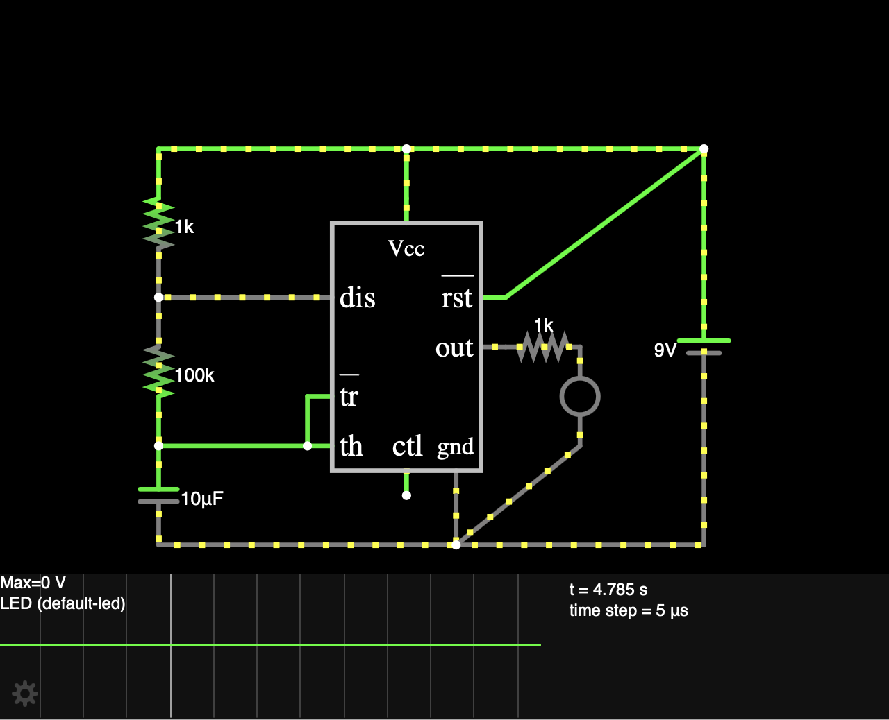

# 37 — LED Blinking Circuit

**Simulator:** Falstad  
**Difficulty:** Beginner  
**Components:** NE555 timer IC, 10kΩ resistor (R1), 1kΩ resistor (R2), LED

---

## What it does
A 555 timer continuously switches its output between HIGH and LOW, creating a square wave. When this drives a LED, the switching frequency becomes the visula output of the LED turning on/off. Change the resistors, change the way the LED switches.

---

## Concept
The NE555 in astable mode produces a continuous square wave whose frequency and duty cycle are controlled by two resistors. This square wave directly drives a LED, making the electrical behavior visually changing resistor values changes the LED's blinking patterns.

R1 controls only the HIGH time.
R2 controls both HIGH and LOW time.
This asymmetry means the circuit can never achieve a 50% duty cycle 
in standard configuration.

---

## How it works
After making the appropriate connections, the two resistors thus, behave as knobs to control the output signal, to test this several observations were made as follows:

**Case - 1: Both resistors set to 1kΩ.**

In this case, the LED seems to have a normal on/off blinking pattern corresponding to the square wave generated with the highs signifying the LED turned on while the lows suggesting it turned off.

**Case - 2: Top resistor set to 10kΩ & bottom set to 1kΩ.**

In this case, when the top resistor is increased, it increases the time for highs, thus letting the LED to remain switched on for a longer time than it is switched off, Hence you can clearly see a change in the pattern of blinking of the LED.

**Case - 3: Top resistor set to 1kΩ & bottom set to 100kΩ.**

Even if you set the bottom one to 10k the noticable difference you will see would be that the the LED is now staying switched off for a slightly longer time than it is on, this is because increasing the value of the bottom resistor increases the time for both the highs and lows, while more for the lows. But, to exxagerate it a bit, if i increase the value to 100k, the time for both increases significantly, creating at times just a low line in the scope, while just a high line sometimes.

---

## What I learnt?

Changing resistor values doesn't just reshape the square wave it changes what you see.

**I HAVE ALSO ADDED THE .txt FILE WHICH YOU CAN DOWNLOAD AND IMPORT IN FALSTAD**