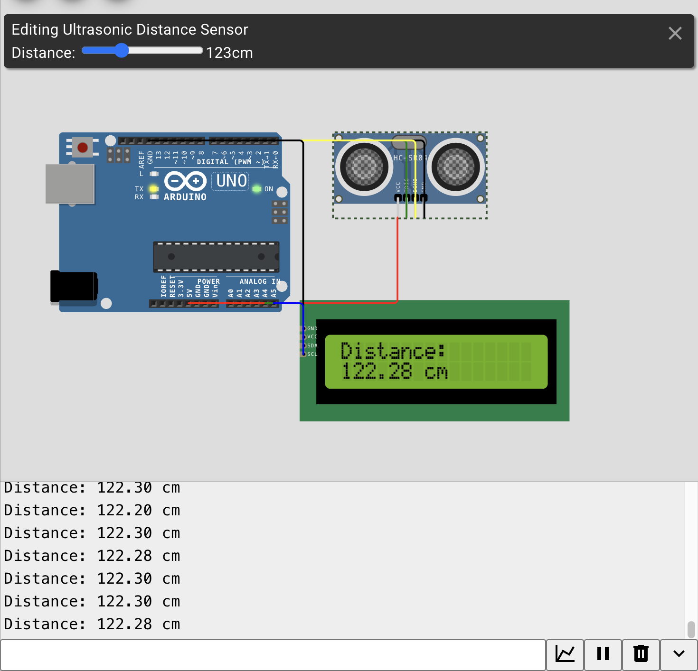

# 17 — Ultrasonic Distance Meter

**Simulator:** Wokwi  
**Difficulty:** Beginner  
**Components:** Arduino Uno, HC-SR04, I2C LCD 16x2

---

## What it does
Measures distance from 2cm to 400cm using ultrasonic echo timing 
and displays it on an I2C LCD in real time.

---

## Concept
HC-SR04 fires an ultrasonic burst and measures the echo return time. 
Speed of sound converts that time to distance:
distance = (duration × 0.034) / 2
`/2` because sound travels there AND back you only want one way.

---

## How it works
Arduino sends a 10µs trigger pulse → sensor fires ultrasonic burst → 
ECHO pin stays HIGH for the round trip duration → `pulseIn()` measures 
that duration → formula converts to cm → LCD displays result.

`pulseIn()` measures the sensor's response, not your trigger. The sensor 
is the one pulling ECHO HIGH — your job is just to listen and measure.

---

## Circuit

---

## Debugging Note
Connecting I2C LCD through a breadboard while also having direct Arduino 
connections creates duplicate SDA/SCL paths that silently break I2C. 
Always connect I2C devices directly.

---

## What I learnt
The same physics behind navy sonar echo time and speed of sound works just fine in a browser simulator.