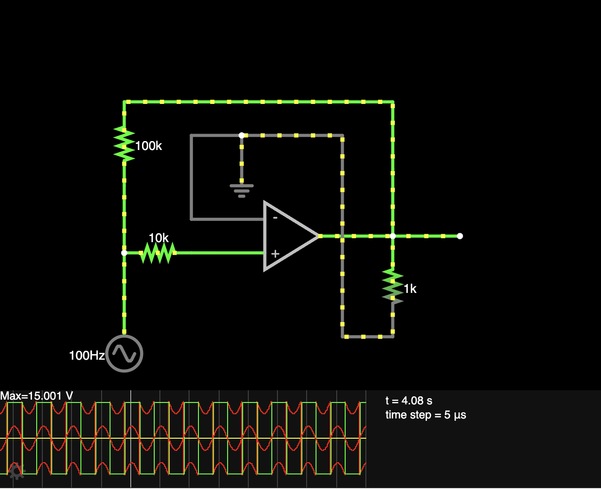
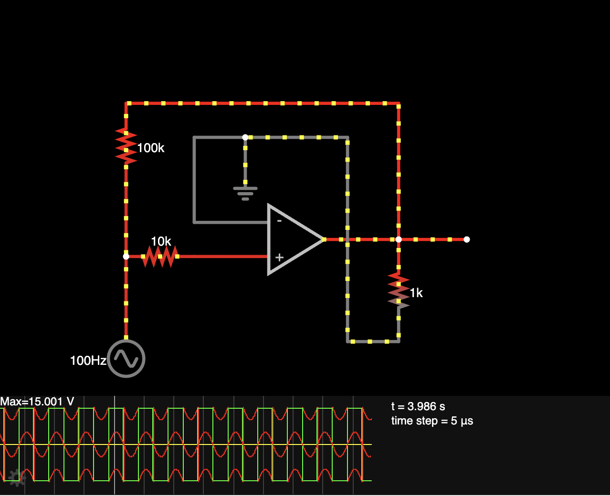

# 178 - Schmitt Trigger

**Simulator:** Falstad  
**Difficulty:** Intermediate  
**Components:** Ideal Op-Amp, 10kΩ resistor (R1), 100kΩ resistor (R2), 1kΩ load resistor, A/C voltage source

---

## What it does
A Schmitt Trigger converts a smooth, continuous analog sine wave into a sharp, clean square wave output. It introduces hysteresis- a two-threshold system-preventing noise and ripple from causing false triggering near zero volts.

---

## Concept
The Op-Amp operates in a positive feedback configuration where a fraction of the output voltage is fed back to the non-inverting input terminal. This creates two distinct switching thresholds: the Upper Threshold Voltage ($V_{UT}$) and the Lower Threshold Voltage ($V_{LT}$).

R1 controls the input coupling to the non-inverting node.
R2 controls the amount of positive feedback from the output.
This arrangement creates a hysteresis gap ($\Delta V = V_{UT} - V_{LT}$), meaning the output stays HIGH until the input drops below $V_{LT}$, and stays LOW until it rises above $V_{UT}$.

---

## How it works
After making the appropriate connections, the circuit processes the input sine wave to generate a clean square wave output as observed below:

When the A/C source feeds a $100\text{ Hz}$, $5\text{ V}$ peak sine wave into the input, the positive feedback loop sets the switching thresholds symmetrically near $\pm 1.35\text{ V}$. As the sine wave smoothly rises past $+1.35\text{ V}$, the op-amp output instantly snaps to $-V_{sat}$ ($-15\text{ V}$). Conversely, when the sine wave falls below $-1.35\text{ V}$, the output snaps back up to $+V_{sat}$ ($+15\text{ V}$). 

This delay between the two threshold points creates hysteresis, ensuring that minor fluctuations or noise near $0\text{ V}$ do not cause false switching, resulting in a crisp, stable square wave synchronized with the input frequency.

---

## What I learnt?

Adding positive feedback turns an ordinary comparator into a bistable circuit with memory, proving that hysteresis can transform noisy analog signals into sharp digital waveforms.

**I HAVE ALSO ADDED THE .txt FILE WHICH YOU CAN DOWNLOAD AND IMPORT IN FALSTAD**