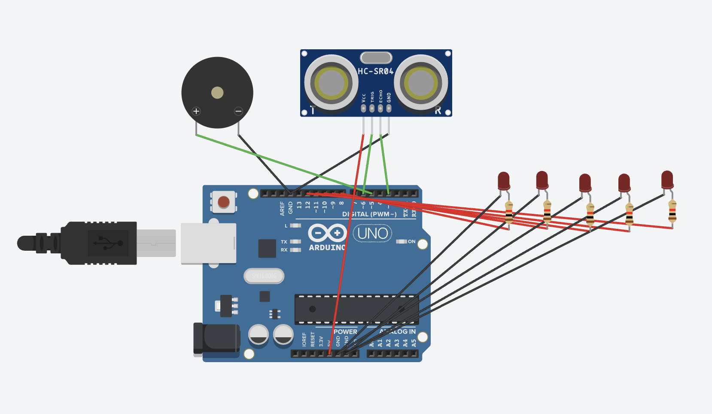

# 213 — Smart Parking Sensor

**Simulator:** Tinkercad  
**Difficulty:** Beginner  
**Components:** Arduino Uno, HC-SR04, 5x LEDs, 5x Resistors, Piezo Buzzer

---

## What it does
Proximity sensor that gives visual and audio feedback as an object 
gets closer exactly like a car parking sensor. LEDs light up one 
by one and buzzer frequency increases as distance decreases.

---

## Concept
Same HC-SR04 distance measurement as #17, but output is zone-based 
rather than precise. Distance is mapped to 6 zones, each with a 
corresponding number of LEDs and buzzer frequency:

| Distance | LEDs On | Buzzer |
|---|---|---|
| > 100cm | 0 | Silent |
| ≤ 100cm | 1 | 900Hz |
| ≤ 90cm | 2 | 1100Hz |
| ≤ 80cm | 3 | 1400Hz |
| ≤ 70cm | 4 | 2000Hz |
| ≤ 60cm | 5 | 2500Hz |
| ≤ 50cm | 5 | 3300Hz |

---

## How it works
Each loop iteration resets all LEDs LOW, measures distance, then 
re-evaluates which LEDs and frequency apply. Since conditions are 
cumulative (if distance ≤ 80, it's also ≤ 90 and ≤ 100), each 
closer zone adds one more LED on top of the previous.

---

## Circuit

---

## Debugging Note
`noTone()` must only be called when out of range not at the 
start of every loop iteration. Calling it unconditionally cancels 
the tone before it plays, making the buzzer silent despite 
`tone()` being called correctly.

---

## What I learnt
Precise measurement and zone-based awareness are two different 
problems. #17 tells you exactly 73.4cm. This tells you 
"getting close, slow down." Real parking sensors use zones 
for exactly this reason drivers don't need precision, 
they need urgency levels.