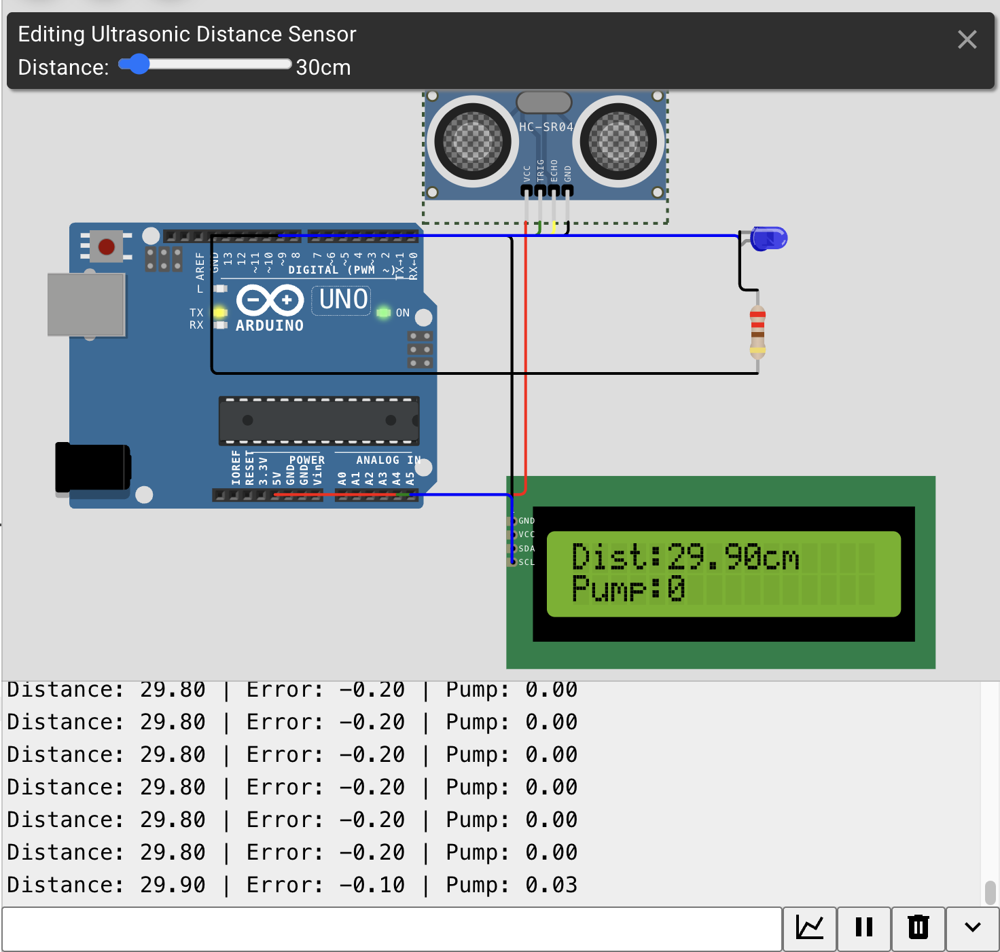
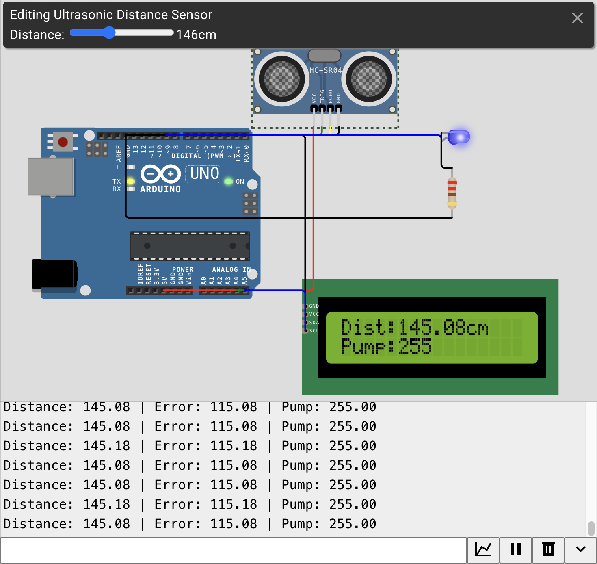
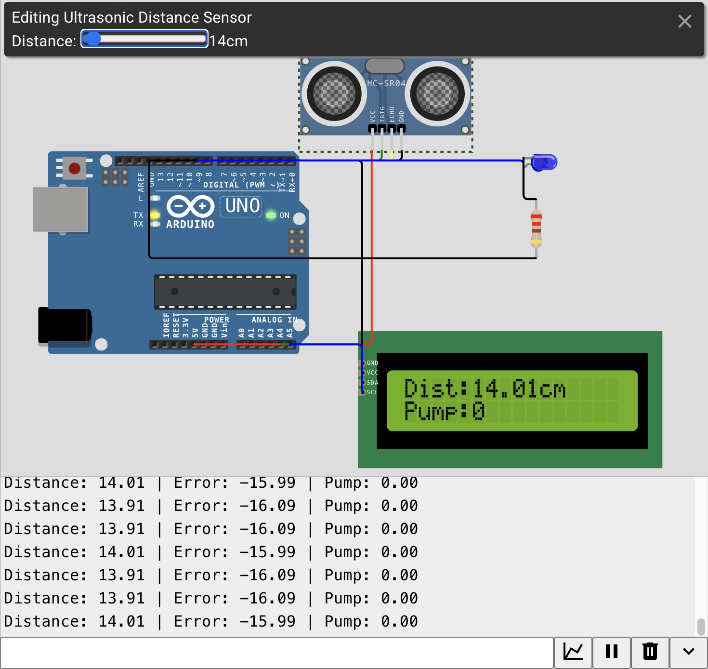

# 284 - PID Level Control System

**Simulator:** Wokwi  
**Difficulty:** Advanced  
**Components:** Arduino Uno, HC-SR04, LED (pump indicator), I2C LCD 16x2

---

## What it does
Maintains a target water level using PID control. HC-SR04 measures 
distance to water surface, system automatically adjusts pump speed 
to hold the level at setpoint.

In simulation distance slider = water level, LED brightness = pump speed.

---

## Why not just ON/OFF?
Simple bang-bang control —> pump ON when low, OFF at target, causes 
continuous oscillation. Water overshoots due to momentum, pump kicks 
back on, overshoots again, never settles.

PID fixes this by varying pump speed continuously instead of switching abruptly.

---

## PID

**P —> Proportional** → responds to current error:
```cpp
float Pterm = Kp * error;
```
Far from target → pump fast. Close → pump slow. At target → pump off.

**I —> Integral** → responds to accumulated error over time:
```cpp
integral += error * 0.2;
float Iterm = Ki * integral;
```
Fixes steady state error -> the small persistent gap P alone can't close 
because pump speed drops too low near target. Integral keeps growing 
until that last gap is eliminated.

Reset when close enough to target to prevent non-zero pump at setpoint:
```cpp
if(abs(error) < 1.0) integral = 0;
```

**D —> Derivative** → responds to rate of change of error:
```cpp
float derivative = (error - lastError) / 0.2;
float Dterm = Kd * derivative;
lastError = error;
```
Predicts where error is heading and dampens response -> prevents overshoot 
before it happens.

**Full PID:**
```cpp
float pumpSpeed = (Kp * error) + (Ki * integral) + (Kd * derivative);
pumpSpeed = constrain(pumpSpeed, 0, 255);
analogWrite(pumpLED, pumpSpeed);
```

`constrain()` clamps to 0-255 —> valid PWM range. Negative values 
(water above target) clamp to 0, pump stays off.

---

## Circuit







---

## What I learnt
PID is three different ways of looking at the same error
where you are, where you've been, and where you're going. 
P alone gets you close. I closes the last gap. D keeps it smooth.
The same algorithm runs drones, cruise control, and industrial systems.
Here's the link to the actual simulation in Wokwi- https://wokwi.com/projects/465178761142889473
