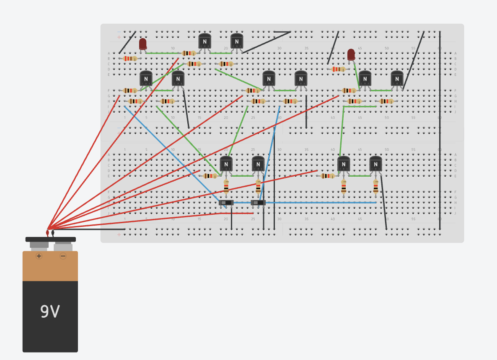
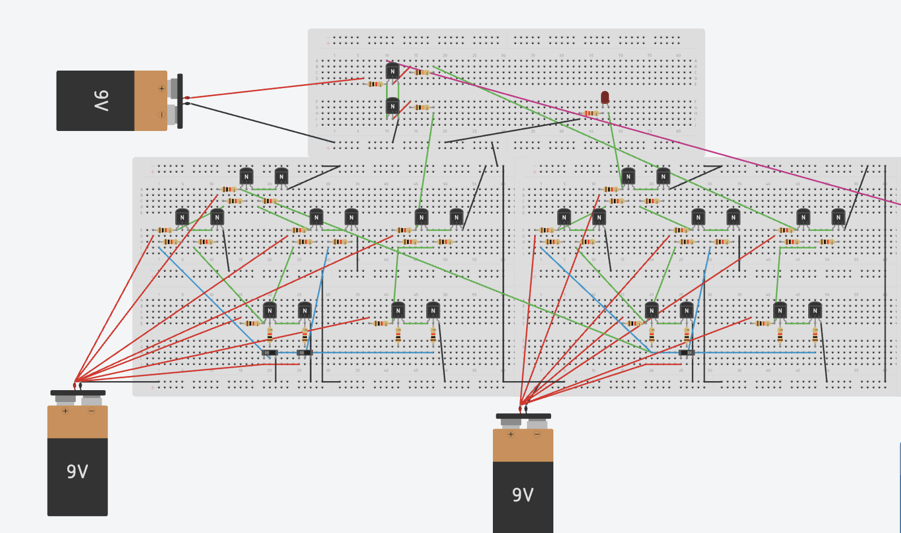
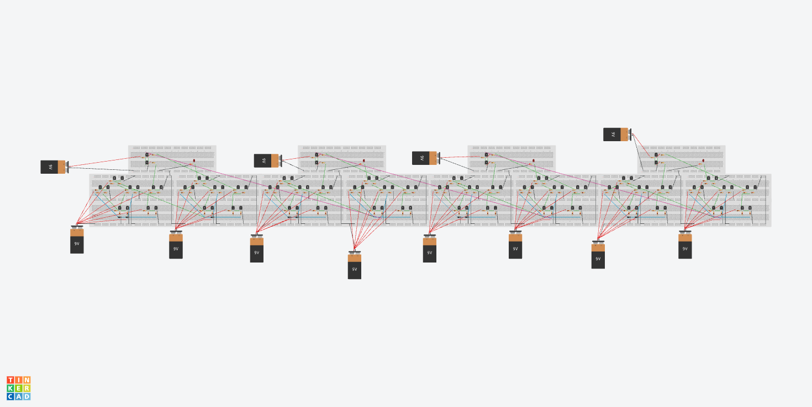

# 4-Bit Ripple Carry Adder from Discrete Transistors

**Simulator:** Logisim & TinkerCad
**Difficulty:** Intermediate-Advanced  
**Components:** NPN Transistors (96x), Resistors, LEDs (5x), Switches (8x)

---

## What it does
Adds two 4-bit binary numbers and outputs a 4-bit sum plus a carry bit — 
built entirely from 96 discrete NPN transistors using RTL (Resistor-Transistor 
Logic). No logic ICs, no gates, no shortcuts. Just transistors.

---

## Concept
Modern computers perform addition using logic gates. Logic gates can be built 
from transistors. This project goes all the way down implementing a 4-bit 
adder at the transistor level, the same way early computers were built before 
integrated circuits existed.

The architecture is a **Ripple Carry Adder** — carry propagates from the least 
significant bit to the most significant bit through four full adder stages, 
each built from transistor-level XOR, AND, and OR logic.

**RTL (Resistor-Transistor Logic)** — the simplest transistor logic family, 
where resistors and NPN transistors form basic gates. A transistor in saturation 
pulls the output LOW, a transistor in cutoff allows the output to be pulled HIGH 
through a resistor.

---

## Hierarchy
NPN Transistors (RTL)
↓
Basic Gates (AND, OR, NOT, XOR)
↓
Half Adder (XOR + AND)
↓
Full Adder (2x Half Adder + OR for carry)
↓
4-Bit Ripple Carry Adder (4x Full Adder)

---

## How it works

**Half Adder:**
This is made up of an XOR and AND gate, sharing the same input.
Takes two single bits A and B.
- Sum = A XOR B
- Carry = A AND B

**Full Adder:**
This is made up of two Half Adders, and an OR gate, taking inputs from both the outputs of AND gates.
Takes two bits plus a carry-in from the previous stage.
- Sum = A XOR B XOR Cin
- Carry-out = (A AND B) OR (Cin AND (A XOR B))

**Ripple Carry:**
Four full adders chained together. The carry-out of each stage feeds into 
the carry-in of the next. The carry "ripples" from bit 0 to bit 3.

**Input/Output:**
- 8 switches — 4 for number A (A3 A2 A1 A0), 4 for number B (B3 B2 B1 B0)
- 5 LEDs - 4 for sum bits (S3 S2 S1 S0), 1 for carry-out

---

## Circuit

**HALF ADDER**

**FULL ADDER**

**4-BIT ADDER**

**LOGISIM CONNECTIONS**

---

## Verification
Verified against binary addition truth table. 

---

## What I learnt
Every logic gate your computer uses is just a transistor switching between 
saturation and cutoff. 96 transistors later, that stopped being abstract.

