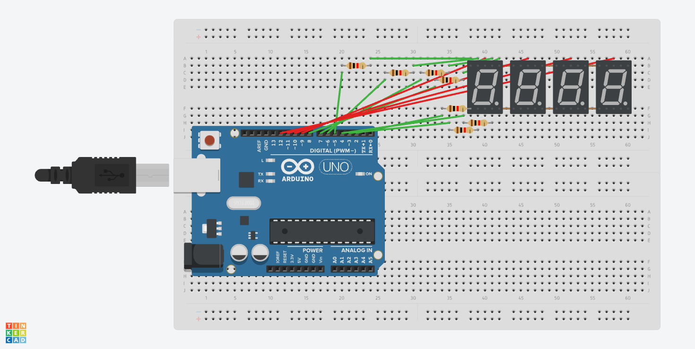

# 4-Digit Multiplexed 7-Segment Calculator

**Simulator:** Tinkercad  
**Difficulty:** Intermediate  
**Components:** Arduino, 4x 7-Segment Displays (common cathode), 
Resistors, Jumper Wires

---

## What it does
A 4-digit calculator that takes two numbers and an operator (+, -, *, /) 
via Serial Monitor and displays the result on a hand-wired 4-digit 
7-segment display using time-division multiplexing.

---

## Concept
Four individual 7-segment displays are wired to a single Arduino. Since 
driving all four simultaneously would require 28+ pins, time-division 
multiplexing is used only one digit is active at any instant, but they 
cycle so fast (1ms per digit) that persistence of vision makes all four 
appear simultaneously lit.

The core challenge is two-fold:
- **Hardware** — wiring 4 individual displays and implementing multiplexing 
  without a driver IC like MAX7219
- **Firmware** — parsing serial input, performing arithmetic, and 
  decomposing the result into individual digits for display

---

## How it works

**Segment Encoding:**
A lookup table maps each digit 0-9 to a 7-element binary array 
representing segments A-G:
```cpp
int numbers[10][7] = {
  {1,1,1,1,1,1,0}, // 0
  {0,1,1,0,0,0,0}, // 1
  ...
};
```

**Digit Decomposition:**
The result is broken into individual digits using integer division 
and modulo:
```cpp
digits[0] = result / 1000;        // thousands
digits[1] = (result / 100) % 10;  // hundreds
digits[2] = (result / 10) % 10;   // tens
digits[3] = result % 10;          // units
```

**Multiplexing:**
The loop cycles through all four digits every 4ms. Each digit is 
activated for 1ms by pulling its common cathode LOW while all others 
are HIGH:
```cpp
for(int i = 0; i < 4; i++) {
    // turn all digits off
    digitalWrite(D1, HIGH);
    digitalWrite(D2, HIGH);
    digitalWrite(D3, HIGH);
    digitalWrite(D4, HIGH);
    // write correct segments
    for(int j = 0; j < 7; j++) {
        digitalWrite(segmentPins[j], numbers[digits[i]][j]);
    }
    // activate this digit
    digitalWrite(i + 9, LOW);
    delay(1);
}
```

**Input via Serial:**
Numbers and operator are entered through Arduino's Serial Monitor. 
The setup() function reads two integers and one character, computes 
the result, and stores it in the digits array before the display 
loop begins.

---

## Circuit



---

## Limitations
- Results limited to 0-9999 (4 digits)
- Negative results not handled
- Division is integer only (no decimals)
- Input only via Serial Monitor, no physical buttons

---

## What I learnt
Multiplexing isn't magic it's just switching fast enough that 
your eye can't tell. The same persistence of vision principle from 
the LED blinking project, applied to make four displays look like one.