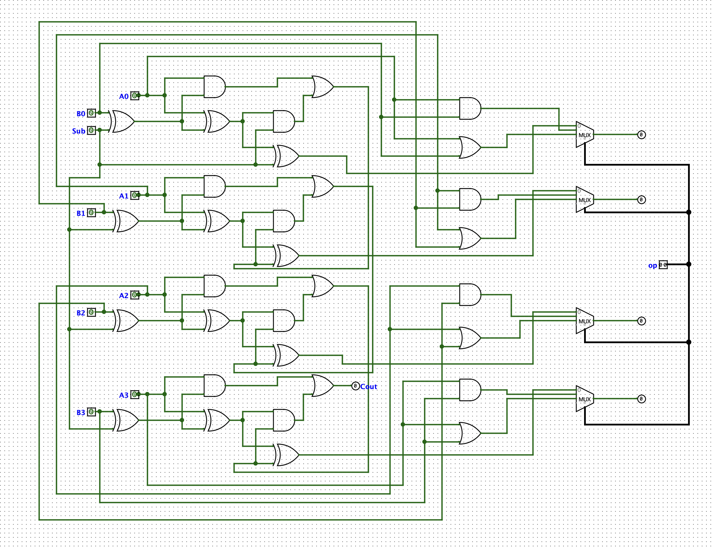

# 4-Bit ALU (Arithmetic Logic Unit)

**Simulator:** Logisim  
**Difficulty:** Advanced  
**Base:** Extended from 4-Bit Ripple Carry Adder (96 transistors)

---

## What it does
A 4-bit Arithmetic Logic Unit supporting four operations:

| Sub | Op | Operation |
|---|---|---|
| 0 | 00 | Addition (A + B) |
| 1 | 00 | Subtraction (A - B) |
| x | 01 | Bitwise AND |
| x | 10 | Bitwise OR |

Operation is selected via a 2-bit control input. All logic built 
from discrete gates in Logisim no black-box ALU components.

---

## Architecture

A[3:0]    B[3:0]    Op[1:0]
        |         |         |
        |    [XOR gates] ←--+-- Op[0] (invert B for subtraction)
        |         |
     [Ripple Carry Adder] → Sum
     [AND gates]          → AND result  
     [OR gates]           → OR result
        |         |         |
     [4x Multiplexers] ←--- Op[1:0]
              |
           Output[3:0]

---

## How each operation works

**Addition (Op = 00 & Sub = 0):**
B passes through XOR gates unchanged (XOR with 0 = B).
Carry-in = 0. Adder computes A + B normally.

**Subtraction (Op = 00 & Sub = 1):**
Op[0] = 1 → XOR gates invert all bits of B (one's complement).
Carry-in = 1 → adds 1, completing two's complement.
Adder computes A + (~B + 1) = A - B.

**AND (Op = 01):**
4 AND gates compute A[i] AND B[i] for each bit pair simultaneously.

**OR (Op = 10):**
4 OR gates compute A[i] OR B[i] for each bit pair simultaneously.

---

## Components added beyond the Adder

| Component | Count | Purpose |
|---|---|---|
| XOR gates | 4 | Conditional B inversion for subtraction |
| AND gates | 4 | Bitwise AND operation |
| OR gates | 4 | Bitwise OR operation |
| Multiplexers | 4 | Output selection based on Op[1:0] |

---

## Two's Complement — the elegant trick

Subtraction without a subtractor circuit:
B in two's complement = ~B + 1
A - B = A + (~B) + 1
The XOR gates handle `~B` (invert when Op[0]=1).
The carry-in handles `+1`.
The same adder that does addition also does subtraction
just with modified inputs. No separate subtraction hardware needed.

---

## Circuit

---

## Verification

| A | B | Sub | Op | Operation | Result |
|---|---|---|---|---|
| 0101 (5) | 0011 (3) | 0 | 00 | ADD | 1000 (8) |
| 0101 (5) | 0011 (3) | 1 | 00 | SUB | 0010 (2) |
| 1010 (10) | 1100 (12) | - | 01 | AND | 1000 (8) |
| 1010 (10) | 0101 (5) | - | 10 | OR | 1111 (15) |

---

## What I learnt
Every processor's ALU is just this adder circuits reused cleverly 
for subtraction via two's complement, with multiplexers selecting 
the right result. The elegance is that subtraction costs almost 
nothing extra four XOR gates and a carry-in bit on top of an 
adder you already have.